# pr-merger
A structured six-phase workflow skill for arbitrating between two or more competing pull requests targeting the same problem. The skill dispatches parallel subagent reviewers, verifies their claims, synthesizes a winner verdict, cherry-picks the best pieces from losers, squash-merges the winner, and closes the rest with auditable, file:line-specific reasons.

## Install

The fastest cross-agent install path is the `skills` CLI:

```bash
npx skills add gg-skills/pr-merger
```

Drop this skill into a workspace as a Git submodule for pinned versions, or as a plain clone for latest `main`:

```bash
# Project-local, version-pinned:
git submodule add git@github.com:gg-skills/pr-merger.git .claude/skills/pr-merger

# OR project-local, latest main:
mkdir -p .claude/skills
git -C .claude/skills clone git@github.com:gg-skills/pr-merger.git

# OR user-level, available in every project on this machine:
mkdir -p ~/.claude/skills
git -C ~/.claude/skills clone git@github.com:gg-skills/pr-merger.git
```

Restart your agent or reload skills after installation. See the parent [`skills` catalog repo](https://github.com/gg-skills/skills) for the full catalog.

## When to use

- "Compare PRs X, Y, Z" — head-to-head comparison of competing branches
- "Pick a winner" / "head-to-head" / "merge one of these"
- "Check if PR N has anything to contribute that we should cherry-pick"
- "Verify if there is anything they have that is better that we should manually incorporate, then close them"
- "Now check PR N" as a follow-up after a previous merge
- Branch names that look like siblings (e.g. `<topic>`, `<topic>-1`, `<topic>-2`)

## How it operates

### Inputs

- **Competing PR numbers or URLs** — two or more PRs targeting the same problem (typically auto-generated by tooling like t3, or human re-rolls). Can also be a single follow-up PR checked against already-merged main.
- **`gh` CLI authentication** — must be authenticated (`gh auth status`) before Phase 1; all PR inspection, merge, and close operations route through `gh`.
- **Git worktrees** (optional but recommended) — pre-staged worktrees enable parallel test runs across candidate branches without branch switching. Discovered via `git worktree list | grep <branch-pattern>`.
- **Repo test surface** — typecheck and test scripts invokable via `npm run` (or equivalent: `cargo test`, `make test`, etc.), needed for Phase 3 claim verification.

### Outputs

- **Winner verdict** — a structured decision citing verified correctness wins (not diff stats) with specific bug references at file:line.
- **Cherry-pick commits on the winner's branch** — any unique improvements from losers (failure-mode tests, helper exports, doc fixes) applied before merge, each committed with a HEREDOC message including `Co-Authored-By:` trailer and `(cherry picked from commit <sha>)` backlink.
- **Squash-merge on main** — `gh pr merge --squash --delete-branch` collapses the winner's history into one commit; the merge body cites the cherry-picks taken.
- **Closure messages for losing PRs** — `gh pr close <N> --comment "..."` with specific bugs at file:line precision and any cherry-picks extracted. Vague "superseded by #N" comments are explicitly prohibited.
- **Shared-limitation inventory** — bugs present in every candidate (and often on main) are surfaced as future-work items, not used as tiebreakers.

### External commands

| Command | Phase | Purpose |
|---|---|---|
| `gh pr list --state all` | 1 | Confirm the competing PR set, including drafts (add `--search "is:pr <topic>"`) |
| `gh pr view <N> --json title,body,additions,deletions,changedFiles,files,headRefName,mergeable,mergeStateStatus` | 1 | Fetch full PR metadata per candidate |
| `gh pr diff <N> > /tmp/pr-compare/pr<N>.diff` | 1 | Save full diff to scratch for subagent consumption |
| `gh pr diff <N> -- <pathspec>` | 1–3 | Filtered diff when corpus/data files dominate |
| `git worktree list` | 1 | Discover pre-staged worktrees for parallel test runs |
| `git show origin/main:<path>` | 3 | Read post-merge state without disturbing the working tree |
| `npm run typecheck` / `npm run test` | 3 | Verify reviewer claims per worktree; substitute repo-specific script names |
| `git log <loser-sha>..HEAD -- <paths>` | 5 | Detect whether a loser's commit is already present via the winner |
| `git cherry-pick -x <sha>` | 5 | Port loser commits with source-SHA backlink |
| `git -c commit.gpgsign=false commit -m "$(cat <<'EOF' ... EOF)"` | 5 | HEREDOC cherry-pick commit message |
| `git push origin <branch>` | 5 | Push cherry-picked winner branch before merge |
| `gh pr merge <N> --squash --delete-branch --subject "..." --body "..."` | 5 | Squash-merge the winner |
| `gh pr close <X> --comment "..." &` | 5 | Close losers in parallel (backgrounded, then `wait`) |

### Side effects

- **Git commits on the winner's branch** — cherry-pick commits are pushed to origin before merge; these persist in the PR diff and are squashed into main.
- **PR state changes** — winner transitions to merged; losers transition to closed. Both are permanent GitHub state changes.
- **Comment writes** — close comments are written to each losing PR via `gh pr close --comment`; these are the permanent audit trail.
- **Branch deletion** — `--delete-branch` on the merge removes the winner's remote branch. Loser branches are left intact (worktree-bound delete-blocked error is expected; do not force).
- **No force-pushes to loser branches** — force-pushing after closure destroys the review history the close comment references.

### Mode toggles

| User cue | Mode | Phases run |
|---|---|---|
| "Compare PRs X, Y, Z" | **compare-only** | 1–4; return verdict, ask before Phase 5 |
| "Proceed" after a verdict | **execute** | 5 + 6 |
| "Check if PR N has anything to contribute" | **cherry-pick check** | Focused comparison vs. post-merge main; port directly, close source PR |
| "Verify if there is anything they have that is better…then close them" | **rigorous cherry-pick check** | Same, but Phase 6 calibration pass is mandatory before declaring "nothing" |
| "Now check PR N" as follow-up to a recent merge | **follow-up check** | Focused single-PR comparison, port wins, close |

## Operational flow

```mermaid
flowchart TD
    A([User: compare PRs N, M, ...]) --> B

    subgraph Phase1["Phase 1 — Snapshot"]
        B[gh pr list --state all\nconfirm competing set] --> C[gh pr view --json\nfetch metadata per PR]
        C --> D[gh pr diff > /tmp/\nsave diffs to scratch]
        D --> E[git worktree list\ndiscover pre-staged worktrees\nrecord origin/main HEAD]
    end

    E --> F

    subgraph Phase2["Phase 2 — Parallel deep review"]
        F[Dispatch one subagent per PR\nin parallel via Agent/Task calls\nreview: algorithm · bugs · tests] --> G[Collect verdicts:\nmerge / merge-with-changes / do-not-merge]
    end

    G --> H

    subgraph Phase3["Phase 3 — Verify claims yourself"]
        H[Run typecheck + tests\nin EACH worktree] --> I[Grep claimed bugs\nacross ALL candidates\nconfirm differentiators vs. shared limitations]
    end

    I --> J

    subgraph Phase4["Phase 4 — Synthesize verdict"]
        J[Pick winner on verified\ncorrectness wins] --> K[List cherry-pick candidates\nfrom losers at file:line\nfailure-mode tests · exports · scripts]
    end

    K --> L{Mode?}
    L -- compare-only --> M([Return verdict\nask before executing])
    L -- execute / proceed --> N

    subgraph Phase5["Phase 5 — Execute"]
        N[Apply cherry-picks\non winner branch\ngit cherry-pick -x] --> O[Run typecheck + tests\nafter EACH cherry-pick]
        O --> P[git push origin winner-branch]
        P --> Q[gh pr merge --squash\n--delete-branch]
        Q --> R[gh pr close losers\nin parallel with --comment\ncite bugs at file:line]
    end

    R --> S

    subgraph Phase6["Phase 6 — Calibrate"]
        S{Verdict was\n'nothing to port'?} -- yes --> T[Rigorous pass: focused subagent\ndiffs implementations side-by-side\nreads test bodies]
        T --> U[Real cherry-picks found?\nport them; update close comments]
        S -- no --> V[Surface shared limitations\nas future-work items\nwith file:line references]
        U --> V
    end

    V --> W([Done: winner merged · losers closed\naudit trail written])
```



## Layout

```
.
├── SKILL.md                      ← entry point: six phases, operating modes, tactical patterns, gotchas
├── agents/
│   └── openai.yaml               ← IDE / agent descriptor
├── references/
│   └── cherry-pick-workflow.md   ← deep playbook for Phase 5 execution: cherry-pick conflict handling,
│                                    HEREDOC commit templates, and the Phase 6 rigorous-pass recipe
└── assets/                       ← skill icons
```

## Quick start

Read [`SKILL.md`](./SKILL.md) first — it carries everything needed for Phases 1–4 (snapshot, parallel review, claim verification, verdict synthesis) inline. The six phases, operating modes (compare-only vs. execute vs. cherry-pick check), tactical `gh` CLI patterns, worktree handling, calibration warnings, and gotchas are all in `SKILL.md`.

Load [`references/cherry-pick-workflow.md`](./references/cherry-pick-workflow.md) only when entering Phase 5 (executing cherry-picks against the winner's branch), when a cherry-pick has produced a conflict or test failure, or when the Phase 6 verdict is "nothing worth porting" and you need the rigorous-pass recipe.

For Phase 2, dispatch one code-reviewer subagent per PR in parallel. For two or three PRs, a single comparison subagent is sufficient; for four or more, use parallel per-PR reviewers plus your own synthesis.

## Resources

- [SKILL.md](SKILL.md) — entry point with all six phases, operating modes, tactical patterns, calibration warnings, and gotchas
- [agents/openai.yaml](agents/openai.yaml) — agent / IDE descriptor
- [references/cherry-pick-workflow.md](references/cherry-pick-workflow.md) — Phase 5 playbook and Phase 6 rigorous-pass recipe
- [assets/](assets/) — skill icons

## Caveats

- **Reviewer subagents over-claim.** They will say they ran tests when they did not, and claim a bug exists in only one PR when it exists in all of them. Always treat their assertions as hypotheses and verify them yourself in Phase 3 before incorporating into the verdict.
- **"Nothing to port" is often wrong — run the calibration pass.** The first-pass test-name comparison is frequently misleading. The Phase 6 rigorous pass (diffing implementations side-by-side, reading test bodies) has produced real cherry-picks on every round where it was applied. Build it into habit, not afterthought.
- **Check for common limitations before calling them differentiators.** If every candidate has the same bug, it is a future-work item, not a tiebreaker. Confirm by grepping the relevant function on every candidate and on main.
- **A loser's commits may already be on main via the winner.** Before any cherry-pick, run `git log <loser-sha>..HEAD -- <paths>` in the winner's worktree. Empty output means the change is already there; skip it and cite duplicate content in the close comment.
- **Close comments must cite specific bugs at exact file:line.** Vague "superseded by #N" comments destroy the audit trail for operators reading the closed PR weeks later.
- **`gh pr list` hides drafts by default.** Run `gh pr list --search "is:pr <topic>" --state all` to catch draft siblings. A draft with the cleanest implementation is the classic miss.
